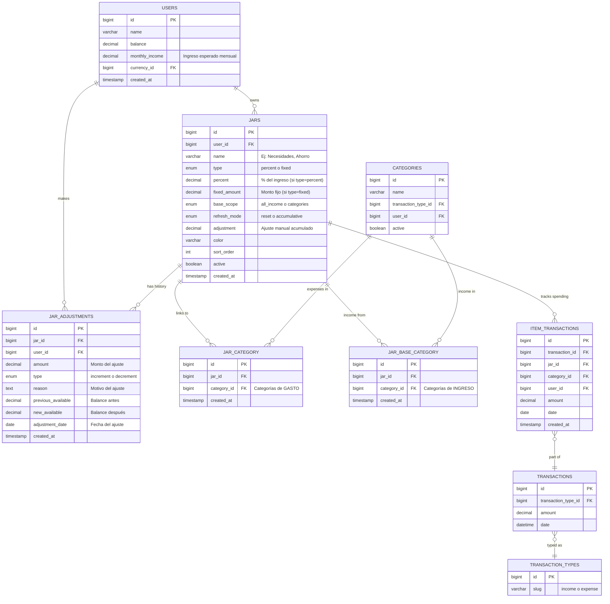
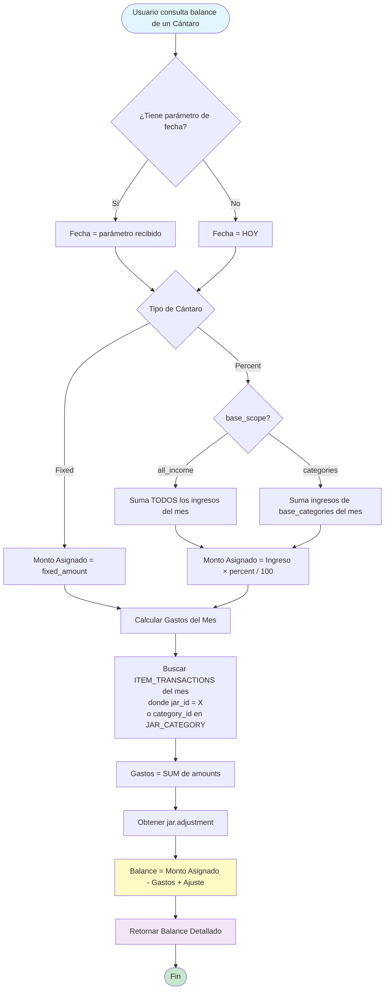
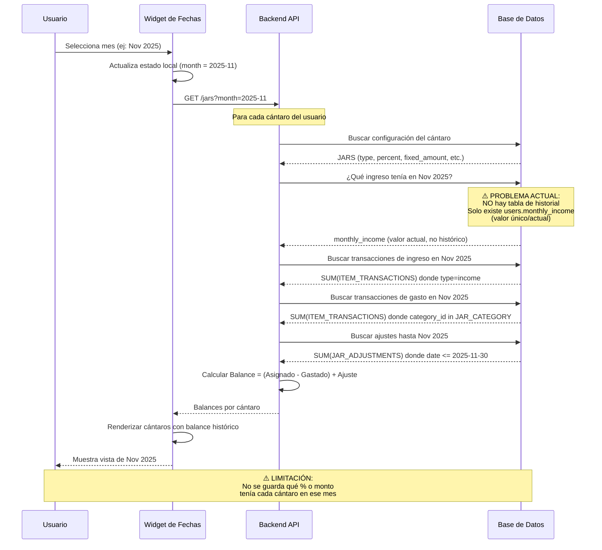
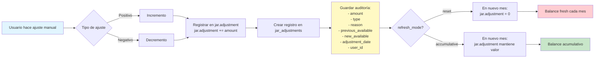
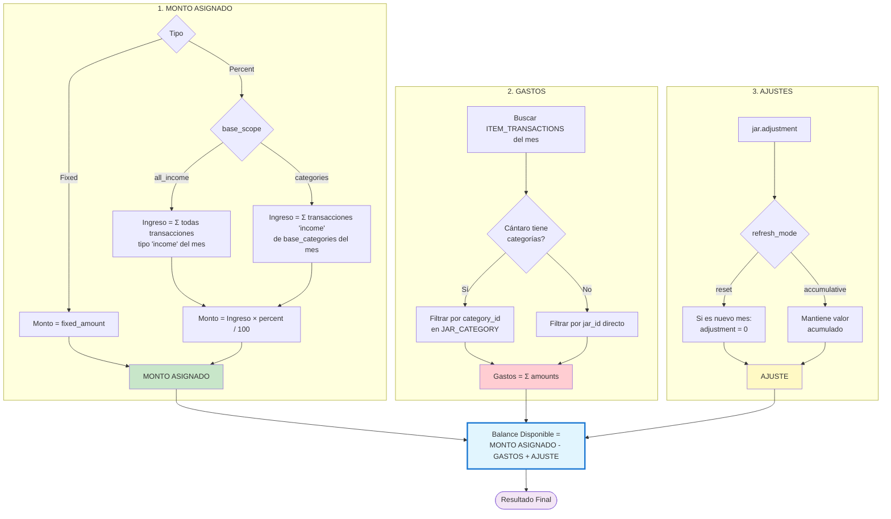
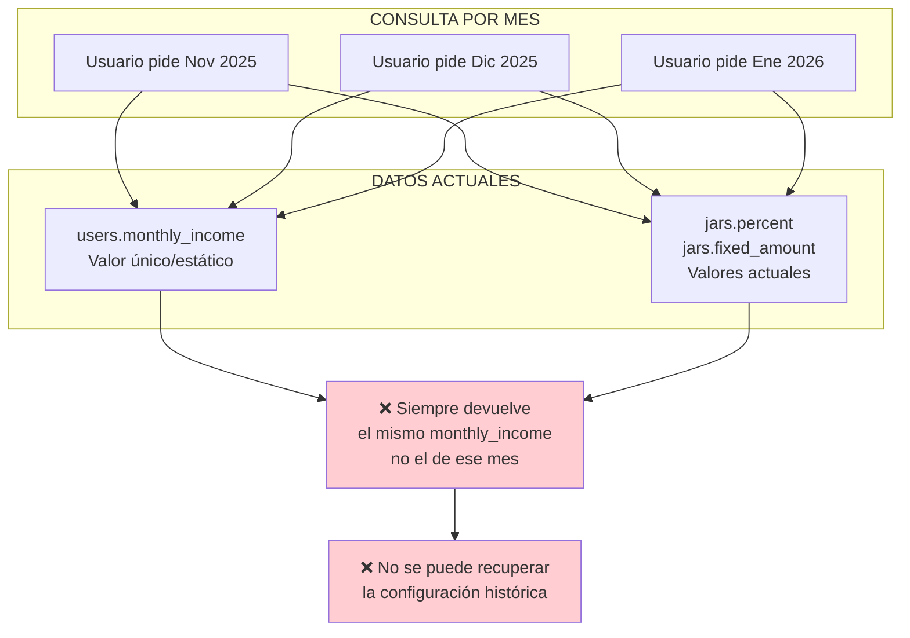
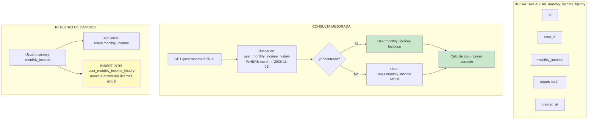
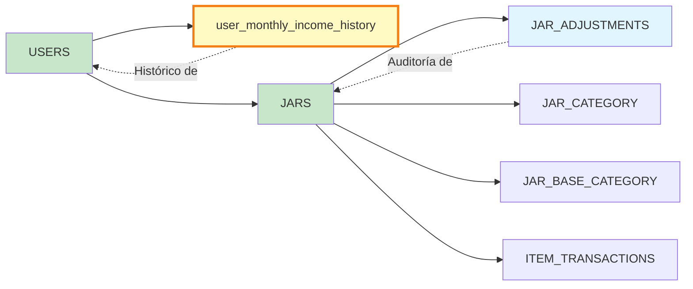

# 🏗️ Arquitectura del Sistema de Cántaros

## 📊 Diagrama de Entidad-Relación (Cántaros y Ajustes)



---

## 🔄 Flujo de Cálculo de Balance



---

## 📅 Flujo de Navegación por Fechas/Meses



---

## 🎯 Sistema de Ajustes (jar_adjustments)



---

## 🔢 Fórmula de Cálculo (Detallada)



---

## ⚠️ PROBLEMA DETECTADO: Navegación Histórica

### Estado Actual



### Solución Propuesta



---

## 📊 Ejemplo Completo: Caso de Uso Real

### Escenario: Usuario con ingresos variables

```mermaid
gantt
    title Evolución de Ingresos y Cántaros
    dateFormat YYYY-MM

    section Ingresos
    Nov 2025: $1,200     :a1, 2025-11, 30d
    Dic 2025: $2,000     :a2, 2025-12, 31d
    Ene 2026: $1,500     :a3, 2026-01, 31d

    section Necesidades (50%)
    $600 (Nov)           :b1, 2025-11, 30d
    $1,000 (Dic)         :b2, 2025-12, 31d
    $750 (Ene)           :b3, 2026-01, 31d

    section Ahorro (30%)
    $360 (Nov)           :c1, 2025-11, 30d
    $600 (Dic)           :c2, 2025-12, 31d
    $450 (Ene)           :c3, 2026-01, 31d
```

**Con el sistema actual:**
- ❌ Si navegas a Nov 2025, usa el `monthly_income` actual (no $1,200)
- ❌ No sabe que en Dic tenías configurado $2,000

**Con la solución propuesta:**
- ✅ Navegas a Nov 2025 → recupera `monthly_income = $1,200` histórico
- ✅ Navegas a Dic 2025 → recupera `monthly_income = $2,000` histórico
- ✅ Calcula correctamente cada cántaro según su configuración de ese mes

---

## 🎯 Implementación Recomendada

### 1. Migración (Nueva Tabla)

```sql
CREATE TABLE user_monthly_income_history (
    id BIGINT PRIMARY KEY AUTO_INCREMENT,
    user_id BIGINT NOT NULL,
    monthly_income DECIMAL(10,2) NOT NULL,
    month DATE NOT NULL COMMENT 'Primer día del mes (2025-11-01)',
    created_at TIMESTAMP,
    updated_at TIMESTAMP,

    FOREIGN KEY (user_id) REFERENCES users(id) ON DELETE CASCADE,
    UNIQUE KEY unique_user_month (user_id, month),
    INDEX idx_user_month (user_id, month)
);
```

### 2. Modificar Endpoint GET /jars

```php
// Aceptar parámetro ?month=2025-11
$month = $request->get('month');
$monthlyIncome = $this->getMonthlyIncomeForMonth($user->id, $month);

private function getMonthlyIncomeForMonth(int $userId, ?string $month): float
{
    if (!$month) {
        return User::find($userId)->monthly_income;
    }

    $firstDayOfMonth = Carbon::parse($month)->startOfMonth();

    $history = UserMonthlyIncomeHistory::where('user_id', $userId)
        ->where('month', $firstDayOfMonth)
        ->first();

    return $history?->monthly_income ?? User::find($userId)->monthly_income;
}
```

### 3. Widget de Navegación Frontend

```typescript
// Cuando usuario cambia de mes
async function onMonthChange(month: string) {
  const response = await api.get(`/jars/income-summary?month=${month}`);
  const jarsResponse = await api.get(`/jars?month=${month}`);

  // Actualizar UI con datos históricos
  updateIncomePanelWithHistoricData(response.data);
  updateJarsWithHistoricBalances(jarsResponse.data);
}
```

---

## 🔗 Relación con Tablas Existentes



---

## 📝 Resumen

1. **Estructura actual**: Completa para cálculos en tiempo real
2. **Problema**: No hay historial de `monthly_income` ni configuración de cántaros
3. **Solución**: Tabla `user_monthly_income_history` para guardar cambios mes a mes
4. **Beneficio**: Navegación histórica precisa, mostrando ingresos y cántaros de cada período
5. **Compatible**: Se integra sin romper funcionalidad existente

¿Deseas que implemente la solución con la nueva tabla y los endpoints actualizados?
